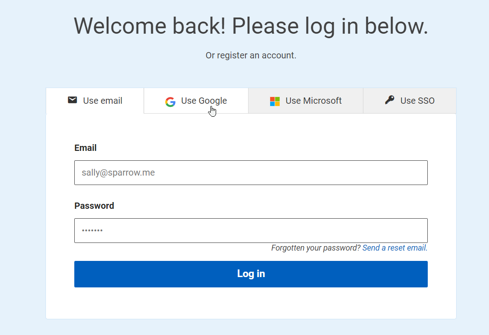
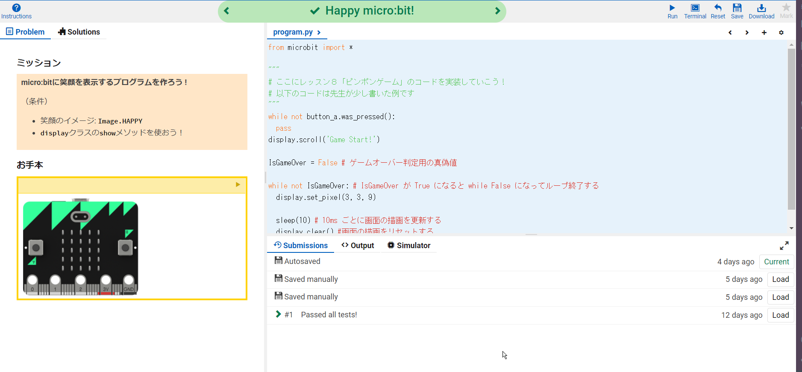

# lesson08-2022-master

作成者: teacher
実施日: 07/21/2022

# 実装する機能

1. [x] micro:bit に文字表示
1. [x] 任意の位置でピクセル描画
1. [x] プレイヤー位置の更新
1. [x] ボタンプッシュ検知
    - ゲーム開始用
    - バーの操作用
1. [x] ボールの速度記録
1. [x] 任意のボール位置でイベント発生させるロジック
1. [ ] スコアロジック
    - ゲームオーバー時に表示するスコア
    - スコアに応じてゲームの難易度を変化させる
    - 難易度の例はボールの速さ増加

# リモートで取り組む人は以下をよく読んで開発していこう！

1. マスタークラスのレッスンブック「レッスン８」にすべて目を通そう。
    - 今回は２回のレッスン（合計180分間）で micro:bit 上で遊べるピンポンゲームを制作します！
1. レッスンブックの内容に目を通せたら、まず 15 分でピンポンゲームで実装しないといけない機能を考えてリストアップしよう。  
    <b>リストアップの仕方</b>
    - レッスンブック「レッスン８」の主な機能のページと以下のピンポンゲームのプレイ動画を参考に実装する機能を考えてリストアップする。
        - https://www.youtube.com/watch?v=BJ520s79cnM
        - https://www.youtube.com/watch?v=BDIrYfzlULE
    - このとき、必ず紙などに書いてリストアップすること。  
    
    - この作業はコードを書き始める前、最初に必ずやること。アプリやサービスを開発することになったとき開発者が最初にやることが、この「要件定義」「機能設計」です。
    - 先生が行った要件定義は上の「実装する機能」に書いているよ。
1. コーディング
    - 自分がリストアップした機能を１つずつ実装していこう。
    - リモートで開発する人は Grok Academy の「micro:bit 短期集中講座」の「１－１章：画像と文字を表示しよう」の "Happy micro:bit!" にコードを書いていこう。こうすると先生がチェックできる！  
    <b>ログイン手順</b>  
        - ロボ団いりなか校の Google アカウントで [Grok Academy](https://groklearning.com/) にログインする。
        
        - 伝えてもらったGoogle アカウントとパスワードでログインしよう。
    - ログインが完了して、「micro:bit 短期集中講座」の「１－１章：画像と文字を表示しよう」の "Happy micro:bit!" を開けたら、ひたすらコーディングです。  
    
    - 先生の例だと、まず実装したのは「ボタンAを押したらゲームスタートする機能」でした。
    - 先生とみんなのソースコードは [https://www.github.com/irinaka-robodone/lesson08-2022-master](https://www.github.com/irinaka-robodone/lesson08-2022-master) に逐次アップロードされるので、行き詰まったら teacher ブランチを参考にしてみよう。
    - [先生のコード(main.py)](https://github.com/irinaka-robodone/lesson08-2022-master/blob/teacher/chapter1/main.py)
    - リモートで参加するみんなのコードも逐次、上の GitHub ページにアップロードされるよ。
    - コーディングはロボ団アプリのレッスンブックにある「micro:bit 文法集」を参照しながら行うこと。タブレットで「micro:bit 文法集」を開きながら、パソコンでコーディングすると良いよ。
1. 書いたプログラムの保存と共有
    - コードを書く途中で適宜、保存をしておこう。"Submit"をする必要はないよ。
    - コードが更新されたのを先生が気づいたら、みんなのコードを GitHub のページにアップロードします！
    - みんなは教えてもらった Google アカウントで間違えずにログインして、保存を忘れずにコーディングをするだけ！

## 最後に先生が少しだけ書いた例です

```python:main.py

from microbit import *

"""
# ここにレッスン８「ピンポンゲーム」のコードを実装していこう！
# 以下のコードは先生が少し書いた例です
"""

while not button_a.was_pressed():
  pass
display.scroll('Game Start!')

IsGameOver = False # ゲームオーバー判定用の真偽値

while not IsGameOver: # IsGameOver が True になると while False になってループ終了する
  display.set_pixel(3, 3, 9)
  
  sleep(10) # 10ms ごとに画面の描画を更新する
  display.clear() #画面の描画をリセットする
```